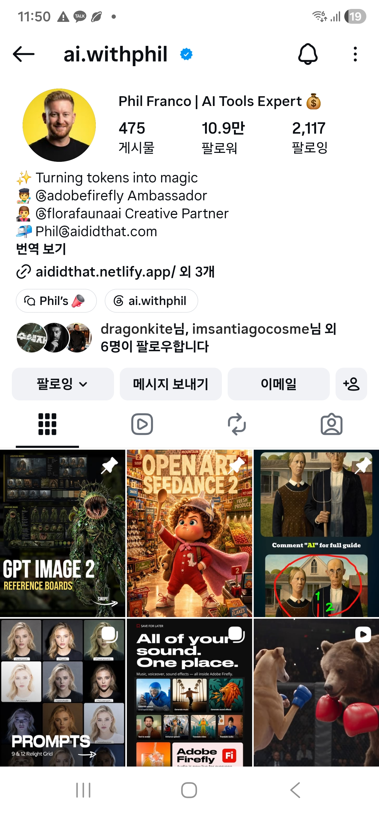

# 프롬프트 잘 만드는사람

### 📌 핵심 요약
AI 툴 전문가이자 Adobe Firefly 앰버서더인 'Phil Franco(@ai.withphil)'의 인스타그램 프로필 스크린샷입니다. 이미지 생성 AI 프롬프트, 리포맷/릴라이팅 가이드, 참고용 리퍼런스 보드 등 유용한 AI 관련 콘텐츠가 게시되어 있습니다.

### 🏷️ 태그 & 카테고리
* **분류**: `테크`
* **태그**: #AI프롬프트, #이미지생성AI, #PhilFranco, #AdobeFirefly, #인스타그램계정, #AI툴

### 📝 원본 내용 / 메모

### 🔍 이미지 속 텍스트 (OCR)
ai.withphil
Phil Franco | AI Tools Expert
475 게시물 10.9만 팔로워 2,117 팔로잉
✨ Turning tokens into magic
🧑‍🎨 @adobefirefly Ambassador
👩‍🎨 @florafaunaai Creative Partner
📬 Phil@aididthat.com
aididthat.netlify.app/ 외 3개
Q Phil's 📣 ai.withphil
dragonkite님, imsantiagocosme님 외 6명이 팔로우합니다
팔로잉 메시지 보내기 이메일
GPT IMAGE 2 REFERENCE BOARDS
OPEN ART SEEDANCE 2
Comment "AI" for full guide
PROMPTS 9 & 12 Relight Grid
All of your sound. One place. Adobe Firefly

### 🖼️ 캡처 이미지

